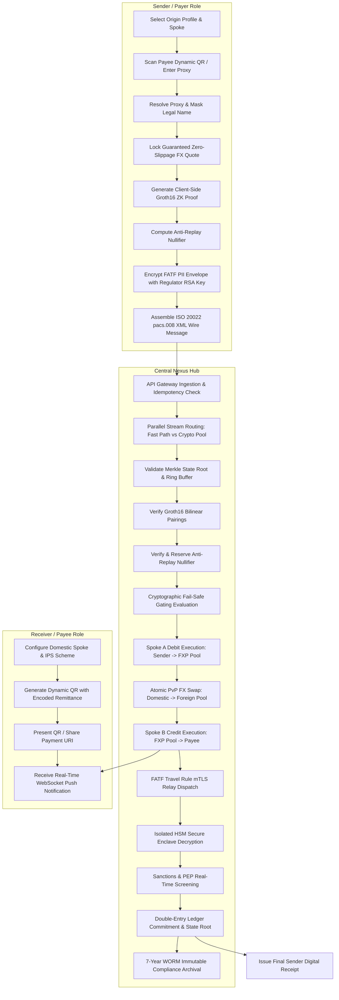

# RHIPay: Next-Gen Privacy-First Financial Rails for Global Commerce
### Technical Architecture, Cryptographic Design & System Specification

---

## 1. Executive Summary

**RHIPay** is an institutional-grade, cross-border, peer-to-peer (P2P) instant payment system built upon the **Bank for International Settlements (BIS) Nexus Hub-and-Spoke model**. It pioneers the integration of **Zero-Knowledge Proofs (ZK-SNARKs)**, **ISO 20022 Financial Messaging Standards (`pacs.008.001.10`)**, **FATF Recommendation 16 (Travel Rule) Enclave Encryption**, and **Deterministic Double-Entry Multi-Currency Ledgers**.

RHIPay connects domestic Instant Payment Systems (IPS)—such as India's **UPI**, Singapore's **PayNow**, UAE's **Aani**, the UK's **Faster Payments (FPS)**, Eurozone's **TIPS**, and the US's **FedNow**—into a single, interoperable, privacy-preserving settlement network.

```
+----------------------------------------------------------------------------------------------------+
|                                    RHIPay BIS Nexus Ecosystem                                      |
+----------------------------------------------------------------------------------------------------+
|                                                                                                    |
|   +-----------------------+           +----------------------+           +---------------------+   |
|   |   Origin Spoke (IN)   |           |    Nexus Hub Core    |           | Destination Spoke(SG)|  |
|   |  - Sender Client App  |           |  - ISO 20022 Gateway |           |  - Receiver QR App  |   |
|   |  - SnarkJS ZK Prover  | --------> |  - Groth16 Verifier  | --------> |  - MAS Reg Enclave  |   |
|   |  - RSA-OAEP Enveloper |   pacs    |  - Nullifier Store   |   pacs    |  - PayNow Clearing  |   |
|   |  - UPI / IMPS Spoke   |   .008    |  - Double-Entry Book |   .008    |  - Fast Push Notify |   |
|   +-----------------------+           +----------------------+           +---------------------+   |
|               |                                  |                                  |              |
|               +-----------------------[ FX Liquidity Desk ]-------------------------+              |
|                               (DBS / HDFC Bilateral Pools)                                         |
+----------------------------------------------------------------------------------------------------+
```

---

## 2. Core Architectural Pillars

| Pillar | Technical Implementation | Purpose / Regulatory Value |
| :--- | :--- | :--- |
| **Mathematical Privacy** | **Groth16 ZK-SNARKs** over **BN254 (Alt-bn128)** & **Poseidon Hasher** ($\text{depth}=16$) | Proves KYC tier authorization and account inclusion without disclosing sender identity or bank account on public rails. |
| **Financial Standard** | **ISO 20022 `pacs.008.001.10`** with `<SplmtryData>` Encapsulation | Full compliance with international cross-border payment standards, encapsulating ZK commitments and encrypted PII. |
| **Statutory Compliance** | **Dual-Layer Hybrid Envelope** (RSA-OAEP-256 + AES-256-GCM) & **HSM Enclaves** | Strict FATF Travel Rule adherence. Decryptable *only* by authorized host statutory regulators (e.g., MAS, RBI, FinCEN). |
| **Atomic Settlement** | **Two-Leg Bilateral Settlement** with **Payment-versus-Payment (PvP)** & **Scaled Integer Accounting** | Eliminates Herstatt foreign exchange settlement risk; guarantees zero float rounding errors ($\sum \text{Debits} \equiv \sum \text{Credits}$). |
| **Anti-Replay Security** | **Single-Use Poseidon Nullifiers** with In-Flight Ephemeral Locking | Prevents double-spending attacks across distributed network nodes with $<1\text{ms}$ lookup latency. |

---

## 3. System Roles & User Experience



### 3.1 Sender (Payer) Experience
- **Sender Profile & Spoke Switching**: Seamless switching between pre-registered sender profiles (e.g., *Rahul Sharma* on India UPI, *Mei Ling* on Singapore PayNow, *Tariq Al-Mansoor* on UAE Aani).
- **Dynamic QR Ingestion & Real-Time Resolution**: Reads QR code, verifies signature, extracts transaction metadata, and queries the Proxy Directory with legal name masking (e.g., `Rahul Sharma` $\to$ `R**** S*****`).
- **Guaranteed FX Quote Lock**: Locks real-time mid-market FX rates with zero-slippage guarantee and cryptographic HMAC-SHA256 signature verification.
- **Client-Side ZK Proof Generation**: Derives local Poseidon secrets and generates Groth16 proofs in $<1.2\text{s}$ within the browser sandbox without leaking credentials.
- **FATF PII Envelope Encryption**: Encrypts originator and beneficiary identity data using the destination regulator's public key (RSA-2048-OAEP-SHA256 + AES-256-GCM).
- **ISO 20022 Assembly**: Constructs compliant `pacs.008.001.10` XML with embedded cryptographic supplementary data.
- **Digital Receipt Verification**: Receives cryptographic proof of settlement with ledger block sequence, UETR, and execution timestamp.

### 3.2 Receiver (Payee) Experience
- **Dynamic & Static QR Code Generator**: Generates ISO-compliant QR codes encoding proxy identifier, currency, amount, payment purpose, and validity window.
- **Universal Proxy Scheme Support**: Accommodates multi-jurisdiction proxies:
  - Mobile Numbers (`+6591234567`, `+919876543210`)
  - Virtual Payment Addresses (`merchant@okhdfcbank`)
  - Unique Entity Numbers / Tax IDs (`201827361R`)
  - National IDs, IBANs, and Email Aliases
- **Real-Time Settlement Notifications**: Displays push toast notifications with ISO 20022 status code `ACCP` (Accepted / Settled) delivered via WebSockets upon completion.

### 3.3 Admin & Compliance Officer Experience
- **Live Telemetry & Performance Metrics**: Real-time monitoring of P99 settlement latency ($<2000\text{ms}$), ZKP verification latency ($<200\text{ms}$), and sanctions screening latency ($<2\text{ms}$).
- **Double-Entry Balance Sheet Telemetry**: Live inspection of bilateral FX pool balances (INR, SGD, AED, USD, etc.) with automated zero-sum invariant assertions ($\Delta = 0.00$).
- **Raw ISO 20022 XML Inspector**: Formats, validates, and visualizes live wire payloads and XML schemas.
- **Cryptographic Audit Log & WORM Storage**: Audits enclave decryption records, PEP hits, OFAC/UN sanctions verdicts, and 7-year Write-Once-Read-Many storage seals.

---

## 4. End-to-End 24-Stage Transaction Lifecycle

```
[ Step 1: Proxy Resolution ]         -->  [ Step 2: Payload Validation ]    -->  [ Step 3: Spoke Config Check ]
[ Step 4: FX Quote Lock ]            -->  [ Step 5: Merkle Path Retrieval ] -->  [ Step 6: Groth16 Proof Gen ]
[ Step 7: Nullifier Derivation ]     -->  [ Step 8: FATF Envelope Encrypt ] -->  [ Step 9: pacs.008 Assembly ]
[ Step 10: Central Gateway Ingest ]  -->  [ Step 11: Queue Stream Route ]   -->  [ Step 12: Merkle Root Validate ]
[ Step 13: Groth16 Pairing Verify ]  -->  [ Step 14: Nullifier Spent Check ]-->  [ Step 15: Crypto Gate Clearance ]
[ Step 16: Spoke A Debit Settle ]    -->  [ Step 17: Atomic PvP FX Swap ]   -->  [ Step 18: Spoke B Credit Settle ]
[ Step 19: Travel Rule mTLS Relay ]  -->  [ Step 20: HSM Enclave Decrypt ]  -->  [ Step 21: Sanctions Screening ]
[ Step 22: Ledger Block Commit ]     -->  [ Step 23: WORM 7-Yr Archival ]   -->  [ Step 24: Push Notify & Receipt ]
```

### Detailed Execution Stages

#### Phase 1: Client Ingestion & Cryptographic Preparation
1. **Proxy Resolution (`/api/v1/proxies/resolve`)**: Translates Payee proxy alias into masked legal name, bank BIC, and destination currency.
2. **Payload Validation (`/api/v1/requests/validate`)**: Validates transaction constraints, schema versions, and payload expiration.
3. **Spoke Verification (`/api/v1/network/spokes/{country}`)**: Confirms origin and destination IPS clearing parameters and decimal precisions.
4. **FX Quote Lock (`/api/v1/fx/quote`)**: Issues an HMAC-signed zero-slippage exchange rate with explicit time-to-live (TTL).
5. **Merkle Path Retrieval (`/api/v1/zk/merkle-path`)**: Retrieves sibling hashes and directional indices for KYC participant commitment.
6. **Client-Side ZKP Proof Generation (`/api/v1/zk/generate-proof`)**: Generates elliptic curve points ($\pi_a, \pi_b, \pi_c$) proving identity inclusion without revealing raw secrets.
7. **Nullifier Computation (`/api/v1/zk/nullifier/compute`)**: Computes deterministic anti-replay hash $\mathcal{N} = \text{Poseidon}(\text{secret}, \text{quote\_hash}, \text{leaf\_idx})$.
8. **FATF PII Envelope Encryption (`/api/v1/compliance/encrypt-envelope`)**: Asymmetrically wraps AES-256 session key under host statutory regulator's public key (RSA-OAEP-256).
9. **ISO 20022 pacs.008 Assembly (`/api/v1/iso20022/assemble-pacs008`)**: Serializes transaction into ISO XML and Canonical JSON with ZK Supplementary Data.

#### Phase 2: Central Gateway Ingestion & Cryptographic Gating
10. **Central Gateway Ingestion (`/api/v1/gateway/ingest`)**: Enforces idempotency via transaction UUID (`UETR`) and authenticates client transport.
11. **Stream Routing & Process Isolation (`/api/v1/routing/route-supplementary`)**: Forks high-priority financial settlement stream from compute-heavy ZK verifier worker pool.
12. **Merkle State Root Validation (`/api/v1/zk/validate-root`)**: Verifies proof root against current active tree and historical TTL ring buffer.
13. **Groth16 Verifier Pairing Check (`/api/v1/zk/groth16/verify`)**: Evaluates bilinear pairing equation on the BN254 elliptic curve across 1,048 arithmetic constraints.
14. **Nullifier Registry Verification (`/api/v1/zk/nullifier/check-and-reserve`)**: Asserts $\mathcal{N} \notin \text{SpentRegistry}$ and acquires ephemeral in-flight lock.
15. **Cryptographic Gating Evaluation (`/api/v1/zk/gating/evaluate`)**: Evaluates all 5 security gates. If all evaluate to `TRUE`, issues an HMAC-signed `ClearanceToken`.

#### Phase 3: Atomic Multi-Leg Settlement & Compliance Execution
16. **Spoke A Domestic Settlement (`/api/v1/settlement/spoke-a`)**: Debits sender retail account and credits bilateral FX provider domestic pool in origin currency.
17. **Atomic FX Liquidity Swap (`/api/v1/settlement/atomic-fx-swap`)**: Executes atomic Payment-versus-Payment (PvP) swap between bilateral currency pools, eliminating Herstatt risk.
18. **Spoke B Host Settlement (`/api/v1/settlement/spoke-b`)**: Debits FX provider foreign pool and credits payee bank account in destination currency.
19. **FATF Travel Rule Dispatch (`/api/v1/compliance/travel-rule/dispatch`)**: Relays encrypted PII envelope to host compliance node via mTLS.
20. **HSM Enclave Decryption (`/api/v1/compliance/enclave/decrypt`)**: Decrypts payload inside statutory hardware enclave boundary (FIPS 140-2 Level 3).
21. **Real-Time Sanctions Screening (`/api/v1/compliance/sanctions/screen`)**: Screens decrypted entities across OFAC SDN, UN, EU, MAS, and PEP watchlists with fuzzy matching.
22. **Double-Entry Ledger Commitment (`/api/v1/settlement/commit-ledger`)**: Commits 4 balanced journal entries to the ledger and increments block sequence.
23. **Statutory 7-Year WORM Archival (`/api/v1/compliance/archive`)**: Cryptographically seals XML, ZKP signals, Travel Rule receipt, and ledger blocks into immutable WORM storage.
24. **Push Notification & Final Receipt (`/api/v1/telemetry/push-notify`, `/api/v1/telemetry/sender-receipt`)**: Dispatches real-time WebSocket confirmation to payee and issues cryptographic digital receipt to sender.

---

## 5. Cryptographic & Mathematical Specifications

### 5.1 Poseidon Hash Function over BN254 Scalar Field
RHIPay implements the Poseidon algebraic hash function over the BN254 scalar field:
$$p = 21888242871839275222246405745257275088548364400416034343698204186575808495617$$

The S-box substitution permutation is defined as:
$$S(x) = x^5 \pmod p$$

### 5.2 Groth16 Bilinear Pairing Equation
Verification of the client-side Groth16 zero-knowledge proof requires evaluating the pairing equation over symmetric groups $\mathbb{G}_1, \mathbb{G}_2, \mathbb{G}_T$:
$$e(\pi_a, \pi_b) = e(\alpha, \beta) \cdot e\left(\sum_{i=0}^{\ell} w_i \cdot \gamma_i, \gamma\right) \cdot e(\pi_c, \delta)$$

Where:
- $\pi_a \in \mathbb{G}_1, \pi_b \in \mathbb{G}_2, \pi_c \in \mathbb{G}_1$
- Public input vector $\vec{w} = [\text{MerkleRoot}, \text{NullifierHash}, \text{QuoteIdHash}, \text{KYCTier}]$
- $\alpha, \beta, \gamma, \delta$ are trusted setup verification key points.

### 5.3 Anti-Replay Nullifier Formula
To prevent double-spending without revealing the sender's Merkle leaf index or identity secret:
$$\mathcal{N} = \text{Poseidon}\Big(\text{IdentitySecret}, \text{Poseidon}(\text{QuoteID}), \text{LeafIndex}\Big) \pmod p$$

### 5.4 Dual-Layer Hybrid Envelope Encryption (FATF Travel Rule)
- **Symmetric Layer**: Payload encrypted via $\text{AES-256-GCM}$ using a 256-bit ephemeral symmetric key $K_{\text{AES}}$ and 96-bit initialization vector $IV$:
  $$\mathcal{C}, \mathcal{T}_{\text{auth}} = \text{AES-GCM-Encrypt}(K_{\text{AES}}, IV, \text{PII\_JSON})$$
- **Asymmetric Layer**: $K_{\text{AES}}$ encrypted using destination statutory regulator RSA-2048 public key:
  $$\mathcal{C}_{\text{key}} = \text{RSA-OAEP-Encrypt}(PK_{\text{Regulator}}, K_{\text{AES}})$$

---

## 6. ISO 20022 Financial Messaging (`pacs.008.001.10`)

RHIPay encapsulates cryptographic privacy proofs and encrypted regulatory payloads within the standard ISO 20022 `<SplmtryData>` block:

```xml
<?xml version="1.0" encoding="UTF-8"?>
<Document xmlns="urn:iso:std:iso:20022:tech:xsd:pacs.008.001.10">
    <FIToFICstmrCdtTrf>
        <GrpHdr>
            <MsgId>RHIPAY/20260818/IN/SG/94B2C8A1</MsgId>
            <CreDtTm>2026-08-18T12:00:00Z</CreDtTm>
            <NbOfTxs>1</NbOfTxs>
            <SttlmInf>
                <SttlmMtd>CLRG</SttlmMtd>
                <ClrSys><Prtry>NEXUS</Prtry></ClrSys>
            </SttlmInf>
        </GrpHdr>
        <CdtTrfTxInf>
            <PmtId>
                <EndToEndId>RHIPAY-FXQ-20260818-B937A201</EndToEndId>
                <UETR>c3f7b2e1-45a8-4b92-91d8-8c10a39f6024</UETR>
            </PmtId>
            <IntrBkSttlmAmt Ccy="SGD">45.00</IntrBkSttlmAmt>
            <InstdAmt Ccy="INR">2835.00</InstdAmt>
            <XchgRateInf>
                <XchgRate>63.000000</XchgRate>
                <RateTp>GUARANTEED_ZERO_SLIPPAGE</RateTp>
            </XchgRateInf>
            <Dbtr>
                <Nm>PROTECTED_ZK_ORIGINATOR</Nm>
                <Id><PrvtId><Othr><Id>+919876543210</Id><SchmeNm><Prtry>NEXUS_PROXY</Prtry></SchmeNm></Othr></PrvtId></Id>
            </Dbtr>
            <DbtrAgt><FinInstnId><BICFI>HDFCINBBXXX</BICFI><Ctry>IN</Ctry></FinInstnId></DbtrAgt>
            <CdtrAgt><FinInstnId><BICFI>DBSSSGSGXXX</BICFI><Ctry>SG</Ctry></FinInstnId></CdtrAgt>
            <Cdtr>
                <Nm>Tan Wei Ling</Nm>
                <Id><PrvtId><Othr><Id>+6591234567</Id><SchmeNm><Prtry>NEXUS_PROXY</Prtry></SchmeNm></Othr></PrvtId></Id>
            </Cdtr>
            <Purp><Cd>P2PR</Cd></Purp>
            <SplmtryData>
                <PlcAndNm>RHIPAY_ZKP_PRIVACY_ENVELOPE_V1</PlcAndNm>
                <Envlp>
                    <ZKPNullifierHash>0x19a8f4c28b6d3e710928a47fbcd561e9382109847162534a9b8c7d6e5f4a3b2c</ZKPNullifierHash>
                    <ZKProofPoints>
                        <Protocol>groth16</Protocol>
                        <Curve>bn128</Curve>
                        <MerkleRoot>0x28f910a8b7c6d5e4f3a2b1c0d9e8f7a6b5c4d3e2f1a0b9c8d7e6f5a4b3c2d1e0</MerkleRoot>
                    </ZKProofPoints>
                    <EncryptedFATFEnvelope>
                        <EnvelopeId>ENV-SG-8F92A1B0</EnvelopeId>
                        <RecipientRegulatorId>MAS-SG-COMPLIANCE-NODE-01</RecipientRegulatorId>
                        <EncryptionAlgorithm>RSA-OAEP-256 + AES-256-GCM</EncryptionAlgorithm>
                        <EncryptedKey>UjBBT1AtMjU2IEtleSBCeXRlcw==</EncryptedKey>
                        <Ciphertext>QUVTLTI1Ni1HQ00gQ2lwaGVydGV4dA==</Ciphertext>
                        <IV>OTYtYml0IElWIE5vbmNl</IV>
                        <AuthTag>MTI4LWJpdCBBdXRoIFRhZw==</AuthTag>
                    </EncryptedFATFEnvelope>
                </Envlp>
            </SplmtryData>
        </CdtTrfTxInf>
    </FIToFICstmrCdtTrf>
</Document>
```

---

## 7. Deterministic Double-Entry Accounting Engine

To prevent rounding and floating-point errors, all balances are stored and operated as **64-bit integer minor units** (paise, cents).

```
+----------------------------------------------------------------------------------------------------+
|                                    Double-Entry Settlement Block                                   |
+----------------------------------------------------------------------------------------------------+
| Leg 1 (Spoke A - INR):                                                                             |
|   1. DEBIT   | ACCT-SENDER-INR-01   (Rahul Sharma)        | INR 2,835.00 ( 283,500 paise)          |
|   2. CREDIT  | ACCT-FXP-INR-01      (DBS Domestic Pool)   | INR 2,835.00 ( 283,500 paise)          |
|              | Net Delta: INR 0.00 (Zero-Sum Invariant Satisfied)                                  |
|                                                                                                    |
| Leg 2 (Spoke B - SGD):                                                                             |
|   3. DEBIT   | ACCT-FXP-SGD-01      (DBS Foreign Pool)    | SGD    45.00 (   4,500 cents)          |
|   4. CREDIT  | ACCT-RECIPIENT-SGD-01(Tan Wei Ling)        | SGD    45.00 (   4,500 cents)          |
|              | Net Delta: SGD 0.00 (Zero-Sum Invariant Satisfied)                                  |
+----------------------------------------------------------------------------------------------------+
```

$$\sum \text{Debits}_{\text{INR}} = \sum \text{Credits}_{\text{INR}} = 283,500\text{ paise}$$
$$\sum \text{Debits}_{\text{SGD}} = \sum \text{Credits}_{\text{SGD}} = 4,500\text{ cents}$$

---

## 8. Technology Stack & Directory Structure

### 8.1 Technology Stack
- **Backend**:
  - Python 3.11+ strictly managed via `uv`
  - FastAPI (Async Web Framework & WebSocket Telemetry)
  - Pydantic v2 (Strict Data Validation & ISO Schemas)
  - PyCryptodome & Cryptography (RSA-OAEP, AES-GCM, SHA-256, HMAC)
  - Pytest (25 comprehensive test suites covering all settlement stages)
- **Frontend**:
  - Next.js 15+ (App Router) & React 19
  - TypeScript (Strict Types & Payment Pipeline Entities)
  - Tailwind CSS & Lucide Icons
  - Sonner (Micro-Interaction Toast Notifications)
  - HTML5 QR Code & Canvas Generators

### 8.2 Repository File Layout

```
RHIPay-Next-Gen-Privacy-First-Financial-Rails-for-Global-Commerce/
├── .agents/                               # Antigravity Skills & Rules
├── backend/
│   ├── app/
│   │   ├── api/v1/
│   │   │   ├── endpoints/
│   │   │   │   ├── compliance.py         # FATF Enclave & Sanctions Endpoints
│   │   │   │   ├── fx.py                 # Guaranteed FX Quote Locking
│   │   │   │   ├── gateway.py            # Central Message Ingestion
│   │   │   │   ├── iso20022.py           # pacs.008 Assembly & Validation
│   │   │   │   ├── network.py            # Country Spokes & IPS Schemes
│   │   │   │   ├── proxies.py            # Proxy Resolution & Directory
│   │   │   │   ├── requests.py           # Dynamic QR Generation & Validation
│   │   │   │   ├── routing.py            # Supplementary Data Stream Split
│   │   │   │   ├── settlement.py         # Spoke A, PvP Swap, Spoke B, Ledger
│   │   │   │   ├── telemetry.py          # Dashboard & Push Telemetry
│   │   │   │   └── zk.py                 # Groth16, Merkle Root, Nullifiers
│   │   │   └── api.py                    # Top-Level Router
│   │   ├── core/
│   │   │   └── config.py                 # System Settings & CORS
│   │   ├── models/                       # 14 Detailed Pydantic Data Models
│   │   ├── services/                     # 14 Core Domain Business Services
│   │   └── main.py                       # FastAPI Application Entry
│   ├── tests/                            # 25 Comprehensive Test Suites
│   ├── pyproject.toml
│   └── uv.lock
├── frontend/
│   ├── src/
│   │   ├── app/                          # Next.js App Router (page.tsx, layout.tsx)
│   │   ├── components/
│   │   │   ├── admin/                    # Admin Dashboard & Live Telemetry
│   │   │   ├── compliance/               # FATF Travel Rule & Enclave UI Cards
│   │   │   ├── gateway/                  # Gateway Ingestion & Routing Cards
│   │   │   ├── receiver/                 # QR Generator, Presenter, Push Modals
│   │   │   ├── sender/                   # 24-Stage Pipeline, FX, ZK Prover, Receipt
│   │   │   ├── settlement/               # Spoke A, PvP Swap, Spoke B, Ledger Cards
│   │   │   └── verification/             # Groth16, Merkle, Nullifier, Gate Cards
│   │   ├── lib/api.ts                    # Strongly-Typed Backend API Client
│   │   └── types/                        # TypeScript Interfaces & User Profiles
│   ├── package.json
│   └── tsconfig.json
├── AGENTS.md                             # Agent Operating Guide
└── SOLUTION.md                           # System Specification (This Document)
```

---

## 9. Verification & Automated Testing

The backend includes 25 modular test suites executing under `pytest` via `uv`:

```bash
cd backend
uv run pytest -v
```

### Test Coverage Highlights
1. `test_proxy_resolution.py`: Validates phone, email, VPA, and UEN resolution with privacy masking.
2. `test_qr_validation.py`: Tests dynamic QR generation, payload expiration, and signature verification.
3. `test_fx_quote.py`: Asserts zero-slippage HMAC signatures, spread calculation, and TTL expiration.
4. `test_zk_proof.py` & `test_groth16_verification.py`: Tests Poseidon Merkle paths, Groth16 verification, and constraint checks.
5. `test_nullifier_registry_check.py`: Tests anti-replay double-spend detection and state tracking.
6. `test_cryptographic_gating.py`: Tests fail-safe rejection when any security check fails.
7. `test_spoke_a_settlement.py`, `test_atomic_fx_swap.py`, `test_spoke_b_settlement.py`: Validates integer arithmetic and balance consistency.
8. `test_pii_envelope.py` & `test_enclave_decryption.py`: Tests hybrid RSA-OAEP + AES-GCM encryption and enclave recovery.
9. `test_sanctions_screening.py`: Verifies OFAC, UN, MAS, and PEP watchlist screening with fuzzy matching.
10. `test_compliance_archival.py`: Tests 7-year WORM storage seals and non-repudiation regulatory signatures.

---

## 10. Summary

RHIPay delivers an instant, privacy-preserving cross-border settlement architecture:
- **Instant Finality**: Sub-2-second end-to-end settlement across sovereign payment systems.
- **True Privacy**: Sender identity and account details remain mathematically hidden via ZK-SNARKs.
- **Regulatory Harmony**: Full FATF Travel Rule and ISO 20022 compliance without compromising user privacy.
- **Elimination of FX Risk**: Atomic Payment-versus-Payment (PvP) execution eliminates Herstatt risk.
- **Fault-Tolerant Accounting**: Deterministic scaled-integer double-entry ledgers ensure zero balance discrepancies.
